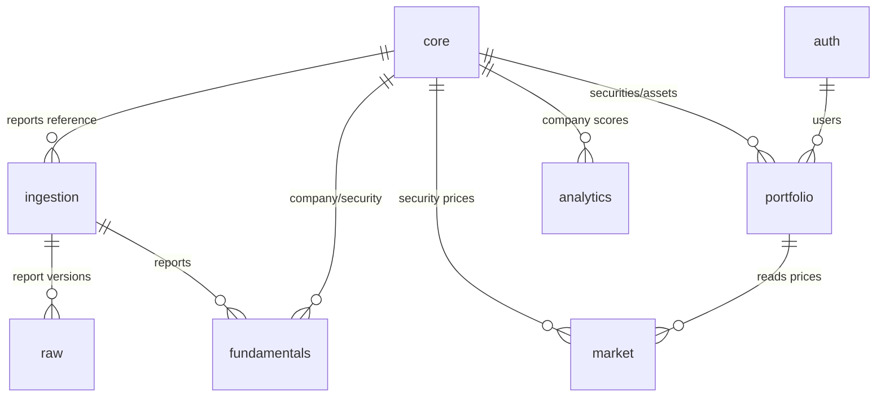
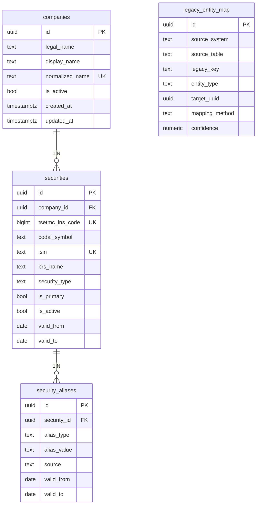
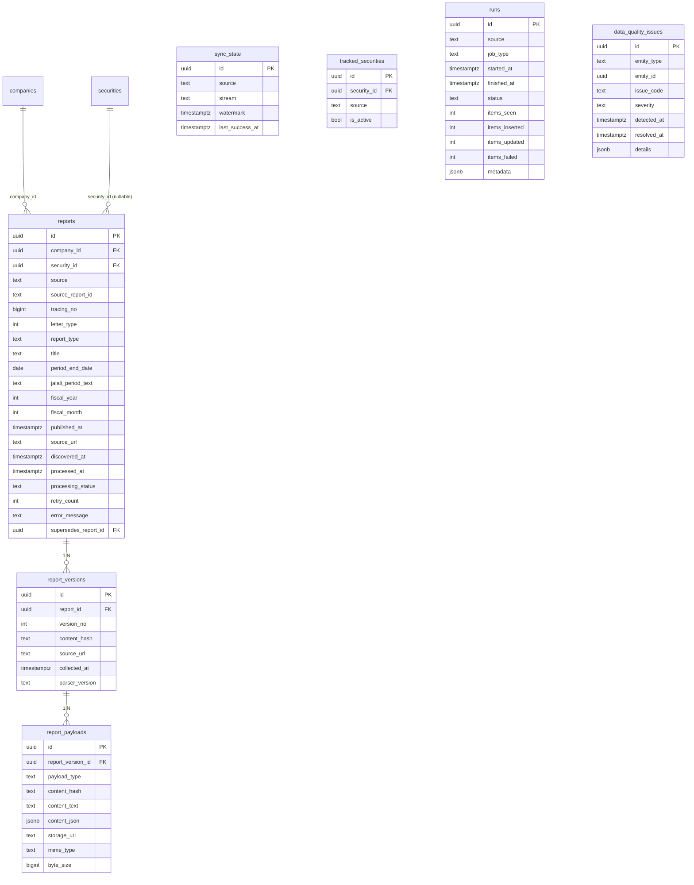
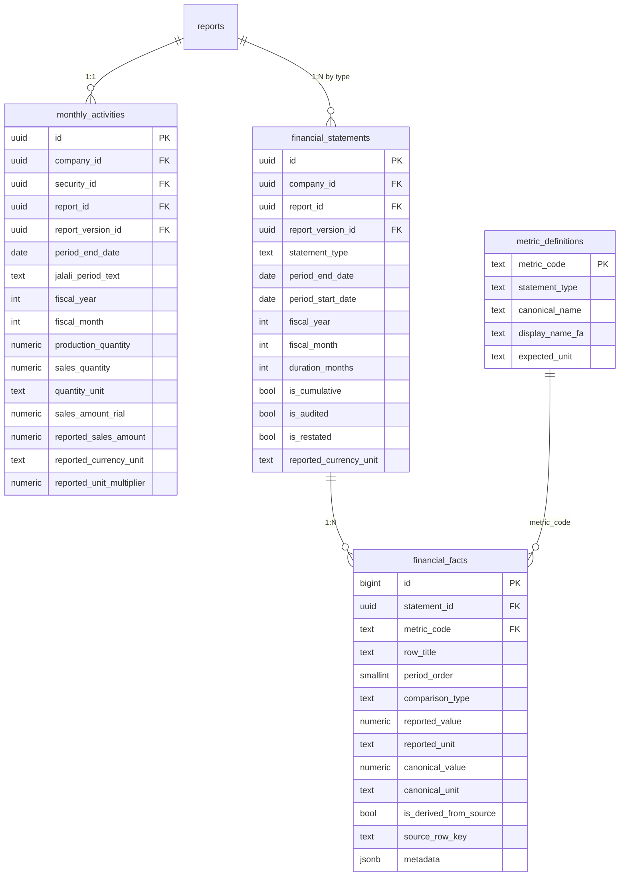
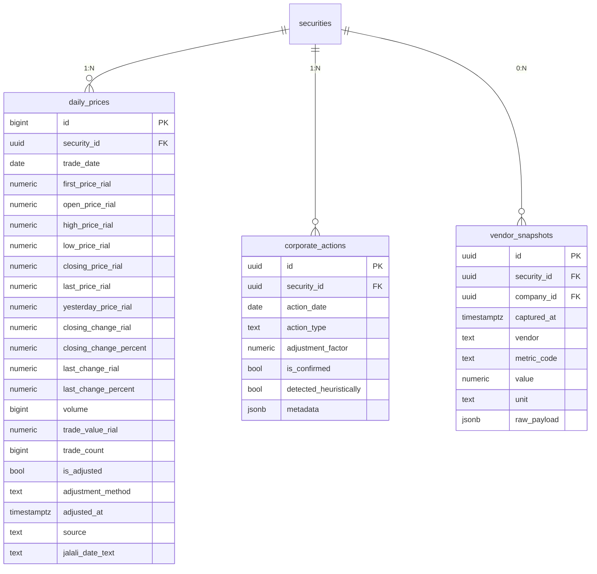
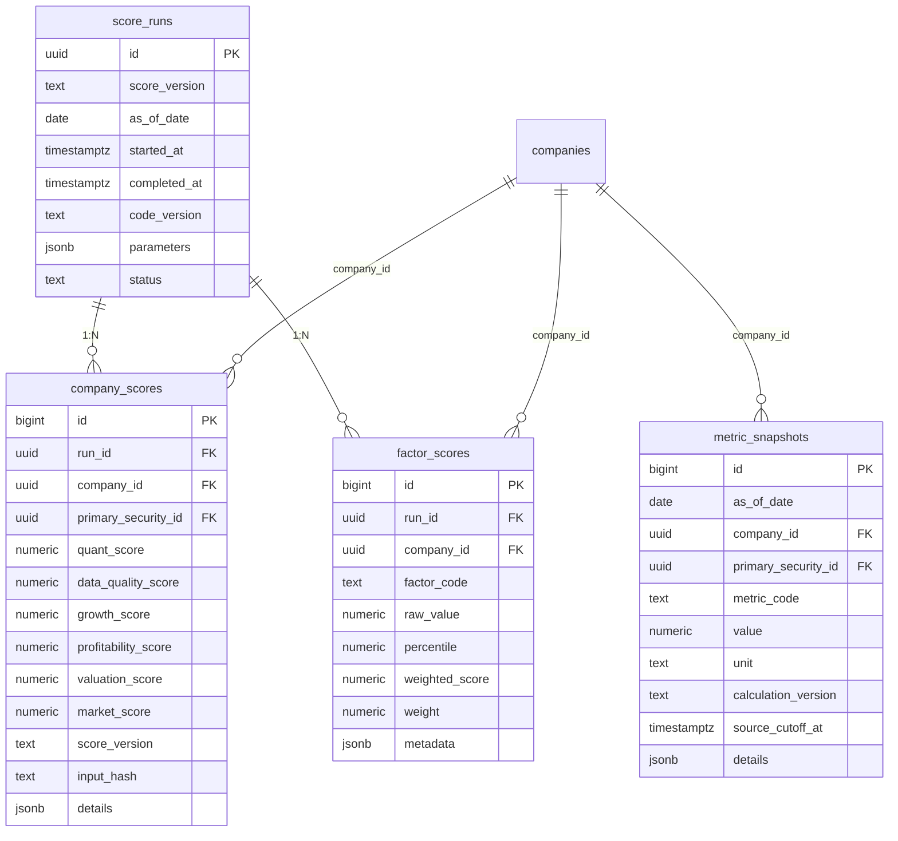
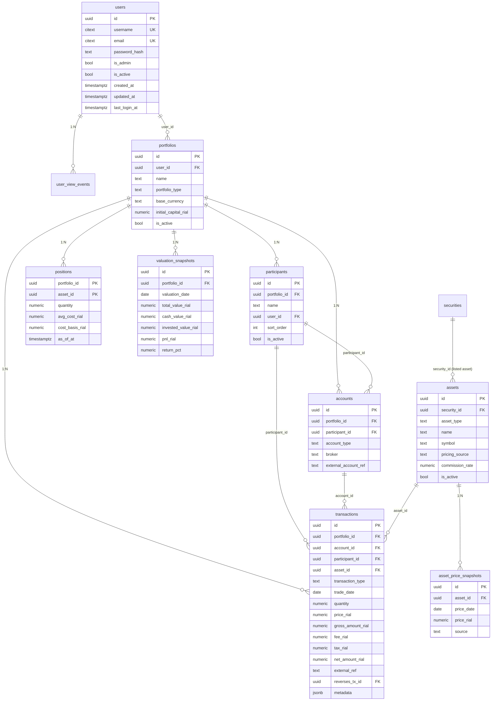

# Canonical PostgreSQL Schema v1 — ERD

> Design artifact (Mermaid). هیچ DB ساخته نشده است.

## High-level domain map

## CORE

## INGESTION + RAW

## FUNDAMENTALS

## MARKET

## ANALYTICS

## AUTH + PORTFOLIO

